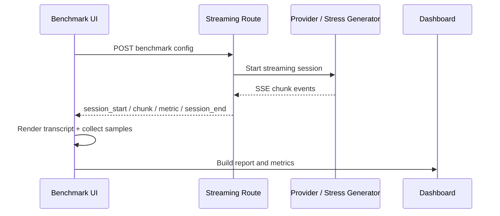

# Super Chat Benchmark Lab

Super Chat is a streaming UI benchmark cockpit for measuring how an AI chat frontend behaves under load.

The project is intentionally built to answer a single question well: **where does the experience slow down when tokens arrive quickly?**

It measures the full path from provider latency to frontend render pressure, including:

- time to first token
- first visible text
- Core Web Vitals
- tokens per second
- chunk interval jitter
- queue depth
- dropped frames
- heap growth
- markdown rendering pressure

## What This Project Demonstrates

- A real-time streaming chat experience with SSE
- A synthetic stress lab for reproducible performance tests
- Metrics collection on both the backend stream and the frontend render path
- A live transcript renderer with markdown support and virtualization for large content
- A telemetry dashboard with charts, thresholds, and bottleneck hints
- Local report persistence for the latest benchmark run

## Tech Stack

- Next.js 15 App Router
- React 19
- TypeScript
- Server-Sent Events for streaming
- `@tanstack/react-virtual` for large markdown transcript rendering
- `react-markdown` + `remark-gfm` for streaming markdown
- `zustand` for local app state
- Next.js Web Vitals reporting

## How The Benchmark Works

The app has two execution modes:

1. `Live` mode streams from a real provider.
2. `Stress Lab` mode streams synthetic content with controlled timing.

Both modes emit the same event shape over SSE:

- `session_start`
- `chunk`
- `metric`
- `session_end`

The client consumes those events, renders the assistant transcript, tracks frame and memory samples during the run, and composes a final benchmark report.

### Streaming Flow

The benchmark flow looks like this:



### What Gets Measured

The report combines several layers of telemetry:

- Backend timing
  - request validation time
  - provider start time
  - provider first chunk time
  - provider completion time
  - average server flush interval
- Frontend timing
  - first visible text
  - chunk processing cost
  - React commit durations
  - queue depth over time
- Experience metrics
  - estimated tokens per second
  - average and max FPS
  - dropped frame ratio
  - heap growth
  - Web Vitals snapshot

## Live Mode

Use `/live` when you want to benchmark a real model provider.

The live route posts provider config to the server, which then streams the model response back as SSE. The route supports:

- Google AI Studio / Gemini
- OpenRouter

The server implementation lives in [app/api/live/route.ts](/Users/piyushzala/Desktop/my%20projects/super-caht/app/api/live/route.ts).

### Live Route Example

```ts
controller.enqueue(
  encoder.encode(
    encodeSseEvent("session_start", {
      sessionId,
      mode: "live",
      provider,
      model: selectedModel,
      preset,
      startedAt
    })
  )
);
```

That same stream then sends each content chunk as it arrives:

```ts
controller.enqueue(
  encoder.encode(
    encodeSseEvent("chunk", {
      sequence,
      delta,
      serverTimestamp: Date.now()
    })
  )
);
```

When the provider finishes, the route emits backend timing and a final session event.

## Stress Lab

Use `/stress` when you want reproducible frontend pressure without provider variability.

This mode generates dense markdown, code blocks, lists, and tables in controlled chunk sizes and intervals so you can reproduce:

- queue buildup
- markdown parsing pressure
- render thrash
- memory drift over long sessions

The preset catalog lives in [lib/prompts.ts](/Users/piyushzala/Desktop/my%20projects/super-caht/lib/prompts.ts) and the content generator lives in [lib/stress-content.ts](/Users/piyushzala/Desktop/my%20projects/super-caht/lib/stress-content.ts).

### Stress Generator Example

```ts
while (output.length < preset.totalCharacters) {
  output += repeatParagraph(preset.label, index);
  output += analysisBlock(index);
  output += numberedList(index);
  output += checklist(index);

  if (preset.contentType === "code" || preset.contentType === "mixed") {
    output += codeBlock(index);
  }

  if (preset.contentType === "table" || preset.contentType === "mixed") {
    output += table(index);
  }

  index += 1;
}
```

### Why Stress Mode Is Useful

This is the best mode for answering questions like:

- Is the model slow, or is the UI slow?
- Does the transcript keep up with rapid token delivery?
- Does the page lose FPS under long markdown streams?
- Does the queue stay near zero, or does backpressure build up?

## Client-Side Benchmark Runner

The benchmark runner in [hooks/use-benchmark-runner.ts](/Users/piyushzala/Desktop/my%20projects/super-caht/hooks/use-benchmark-runner.ts) is responsible for:

- starting and stopping a benchmark session
- buffering incoming chunks
- capturing frontend samples on animation frames
- reading Web Vitals for the current page load
- building the final report
- storing the latest report in `localStorage`

### Sampling Example

The app trims large stored arrays before writing reports to keep browser storage manageable:

```ts
function sampleArray<T>(values: T[], cap: number) {
  if (values.length <= cap) return values;
  const stride = Math.ceil(values.length / cap);
  const sampled: T[] = [];
  for (let index = 0; index < values.length; index += stride) {
    sampled.push(values[index]);
  }
  return sampled;
}
```

This is used when persisting reports so large benchmark runs do not overflow browser storage.

### Derived Metrics Example

The metrics layer in [lib/metrics.ts](/Users/piyushzala/Desktop/my%20projects/super-caht/lib/metrics.ts) converts raw timings into benchmark-friendly numbers:

```ts
export function computeDerivedMetrics(input: {
  startedAt: number;
  firstChunkAt: number | null;
  firstVisibleAt: number | null;
  completedAt: number | null;
  charactersReceived: number;
  chunkIntervals: number[];
  chunkProcessMs: number[];
  frontendSamples: FrontendSample[];
  queueDepths: number[];
  stallCount: number;
  reconnects: number;
  commitDurations: number[];
}): DerivedMetrics {
  const estimatedTokens = estimateTokens(charactersReceived);
  const totalDurationMs = completedAt ? completedAt - startedAt : null;
  const estimatedTokensPerSecond =
    totalDurationMs && totalDurationMs > 0
      ? estimatedTokens / (totalDurationMs / 1000)
      : null;

  return {
    ttftMs: firstChunkAt ? firstChunkAt - startedAt : null,
    firstVisibleTextMs: firstVisibleAt ? firstVisibleAt - startedAt : null,
    totalDurationMs,
    estimatedTokensPerSecond,
    backpressureActive: maxQueueDepth >= 4 && queueAvg > 1 && avgIncomingGap > 0
  };
}
```

The dashboard then uses those derived values to explain whether the bottleneck is provider-side, transport-side, or frontend-side.

## Dashboard And Report

The dashboard in [components/dashboard-panel.tsx](/Users/piyushzala/Desktop/my%20projects/super-caht/components/dashboard-panel.tsx) visualizes:

- tokens per second
- chunk interval trends
- queue depth
- heap growth
- bottleneck hints
- Web Vitals

The results page in [app/results/[id]/page.tsx](/Users/piyushzala/Desktop/my%20projects/super-caht/app/results/[id]/page.tsx) loads the latest report from local storage and lets you inspect the full JSON payload.

The report contains:

- session metadata
- prompt text
- backend timing
- derived metrics
- frontend samples
- chunk intervals
- token timeline
- queue timeline
- Web Vitals
- environment metadata

## Transcript Rendering

The transcript pane supports streaming markdown and switches to virtualization for very large content so the DOM does not get overwhelmed.

That logic is implemented in [components/transcript-pane.tsx](/Users/piyushzala/Desktop/my%20projects/super-caht/components/transcript-pane.tsx).

This matters because benchmark content can get huge, especially in stress mode. The renderer is designed to keep the transcript readable while still making performance problems visible.

## Report Storage

Completed reports are stored in `localStorage` under:

- `benchmark-report:current`

Before writing a new report, older benchmark report keys are cleared so stale sessions do not pile up.

This gives the app a simple and reliable recovery path after refreshes:

- the latest completed run is restored first
- session-id lookup is still supported as a fallback

## Web Vitals

The app captures Web Vitals through Next.js `useReportWebVitals` and includes that snapshot in each report.

That means every benchmark can be compared against standard page health metrics like:

- `CLS`
- `FCP`
- `INP`
- `LCP`
- `TTFB`

If debug mode is enabled, Web Vitals are also logged to the console with a benchmark-specific prefix.

## Debugging Performance

Enable debug mode with either:

- `?benchmarkDebug=1`
- `localStorage["benchmark-debug-perf"] = "1"`

When enabled, the app logs extra signals such as:

- flush timing
- Web Vitals
- markdown streaming preparation cost
- React render durations
- virtualized markdown render durations

This helps isolate whether the bottleneck is:

- stream cadence
- transcript rendering
- markdown parsing
- queue buildup

## Project Structure

- [app/page.tsx](/Users/piyushzala/Desktop/my%20projects/super-caht/app/page.tsx) - landing page
- [app/live/page.tsx](/Users/piyushzala/Desktop/my%20projects/super-caht/app/live/page.tsx) - live benchmark mode
- [app/stress/page.tsx](/Users/piyushzala/Desktop/my%20projects/super-caht/app/stress/page.tsx) - synthetic stress lab
- [app/api/live/route.ts](/Users/piyushzala/Desktop/my%20projects/super-caht/app/api/live/route.ts) - provider-backed SSE stream
- [app/api/stress/route.ts](/Users/piyushzala/Desktop/my%20projects/super-caht/app/api/stress/route.ts) - synthetic SSE stream
- [components/benchmark-experience.tsx](/Users/piyushzala/Desktop/my%20projects/super-caht/components/benchmark-experience.tsx) - page composition
- [components/dashboard-panel.tsx](/Users/piyushzala/Desktop/my%20projects/super-caht/components/dashboard-panel.tsx) - telemetry dashboard
- [components/transcript-pane.tsx](/Users/piyushzala/Desktop/my%20projects/super-caht/components/transcript-pane.tsx) - streaming transcript renderer
- [hooks/use-benchmark-runner.ts](/Users/piyushzala/Desktop/my%20projects/super-caht/hooks/use-benchmark-runner.ts) - benchmark state and report builder
- [lib/metrics.ts](/Users/piyushzala/Desktop/my%20projects/super-caht/lib/metrics.ts) - derived metric calculations
- [lib/sse.ts](/Users/piyushzala/Desktop/my%20projects/super-caht/lib/sse.ts) - SSE encode/parse helpers
- [lib/prompts.ts](/Users/piyushzala/Desktop/my%20projects/super-caht/lib/prompts.ts) - prompt and stress presets
- [lib/stress-content.ts](/Users/piyushzala/Desktop/my%20projects/super-caht/lib/stress-content.ts) - synthetic content generator

## Getting Started

1. Install dependencies:

```bash
npm install
```

2. Add environment variables in `.env` if you want to use live provider mode.

3. Start the app:

```bash
npm run dev
```

Open the local Next.js app and choose either the live benchmark or the stress lab.

## Scripts

- `npm run dev` - start the development server
- `npm run build` - create a production build
- `npm run start` - start the production server
- `npm run typecheck` - run TypeScript checks

## Notes

- The transcript renderer batches flushes to reduce frame pressure when tokens arrive quickly.
- The stress content is intentionally dense so it can expose render bottlenecks, queue growth, and memory drift.
- Reports are intended to be short-lived and local to the browser session unless you export the JSON manually.
